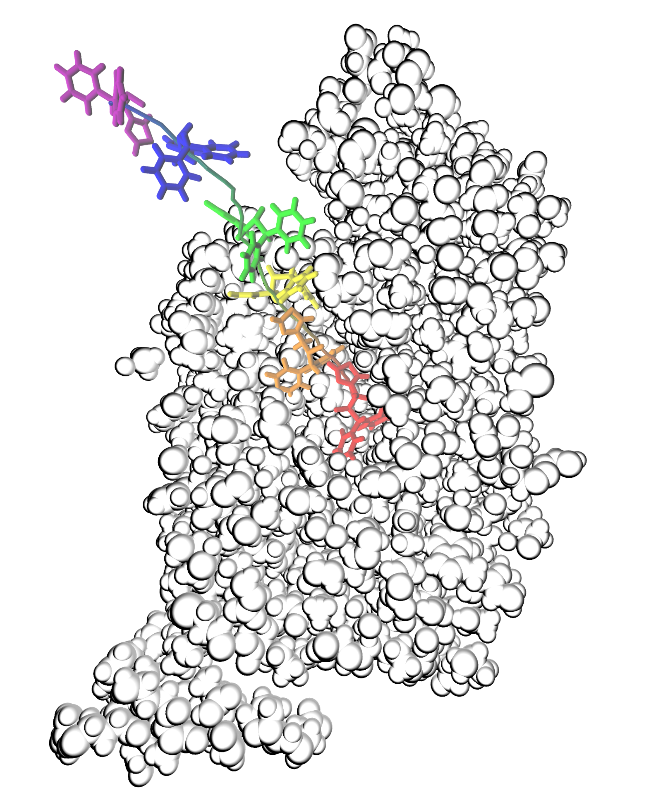
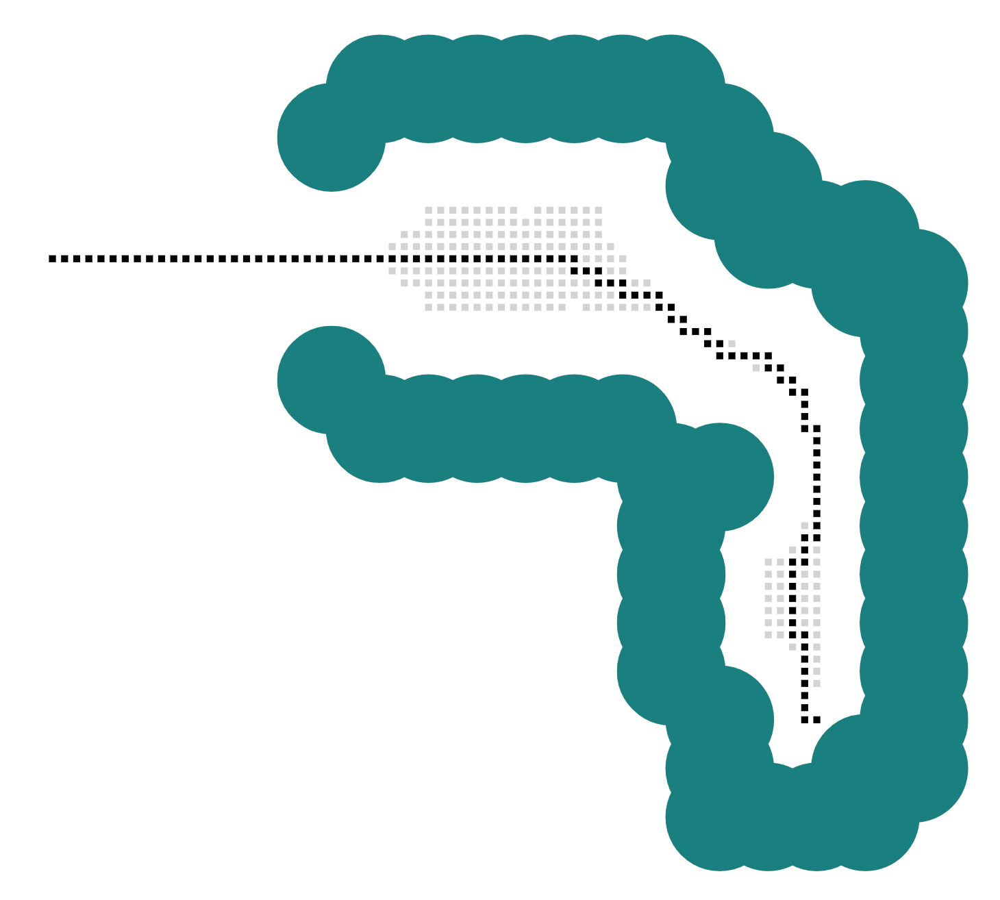
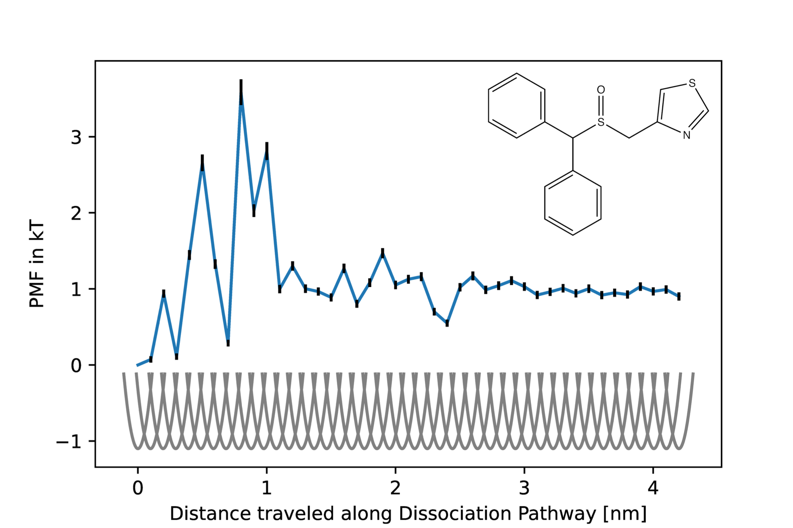

UmbrellaPipeline
==============================
[//]: # (Badges)
[](https://github.com/nmaeder/UmbrellaPipeline/actions?query=workflow%3ACI)
[](https://codecov.io/gh/nmaeder/UmbrellaPipeline/branch/main)
[](https://umbrellapipeline.readthedocs.io/)

Umbrella Sampling Pipeline for PMF of Protein Ligand Unbinding

## What it does and how it works

This package estimates the sterically least hindered protein ligand dissociation pathway, conducts umbrella sampling along this pathway and subsequently calculates the Potential of Mean Force (PMF) for the protein ligand unbinding. No alignement of the protein cavity or manually placing ligands necessary.




### Path Finding
Using a modified version of the A* path finding algorithm, this tool takes a docked ligand as a starting point, and then finds (if existing) the sterically least hindreds way out of the protein cavity by following a simple best-first search algorihtm. 



### Sampling

All sampling is done using openmm. After a equilibration period, the ligand is then placed at evenly spaced positions along the dissociation pathway and umbrella sampling is conducted.

### PMF Calculations

The trajectories are analysed and the PMF is calculated using pymbar.



## How-To

Visit the [Documentation](https://umbrellapipeline.readthedocs.io/en/latest/examples.html).

## Requirements

- Python 3.7, 3.8, 3.9
- pip
- numpy
- openmm
- openmmtools
- scipy
- pymbar
- matplotlib
- plotly
- gemmi

## Installation
Either download the source code or clone the repository to the desired destination and run 
```
python setup.py install
```
inside the downloaded folder. Make sure to install the needed dependencies first.


### Maintainer

- Niels Maeder <maedern@student.ethz.ch> (ETH Zürich)

### Copyright

Copyright (c) 2022, Niels Maeder

#### Acknowledgements
 
Project based on the 
[Computational Molecular Science Python Cookiecutter](https://github.com/molssi/cookiecutter-cms) version 1.6.
